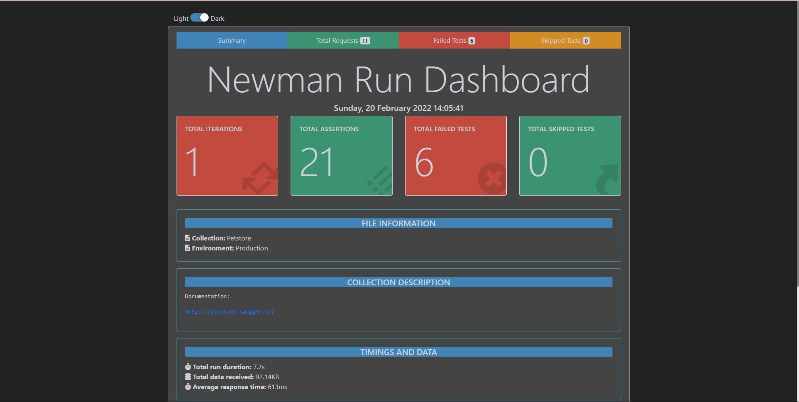

### API Documentation
https://petstore.swagger.io/

### Running Postman in CLI using Newman
1. Install Newman
`npm install -g newman`
2. Install Newman HTML Reporter
`npm install -g newman-reporter-html`
3. Run test
`newman run Petstore_collection.json -e Production_environment.json -r htmlextra,csv`

### Sample Report

### Reference
https://github.com/postmanlabs/newman
